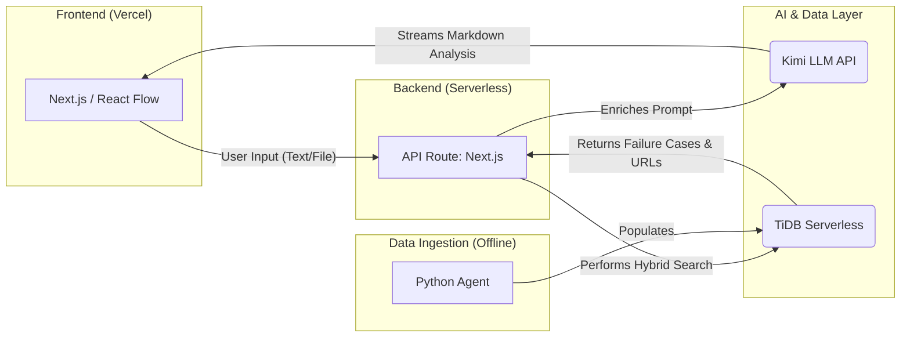

# Cassandra - The Failure Prophet

[](https://tidb-2025-hackathon.devpost.com/)
[](https://opensource.org/licenses/MIT)
[](https://x.com/IslamHachimi)

**Cassandra is an AI co-pilot for startup founders that de-risks new ventures by analyzing them against a knowledge base of 1,000+ startup failures.**

Developed by [mr-green1337](https://github.com/mr-green1337) for the TiDB AgentX Hackathon 2025.

---

### **[➡️ Live Demo ⬅️](https://use-cassandra.vercel.app)**


### TL;DR: What is this?

The tech industry celebrates launches but learns little from failures. Cassandra changes that. It's a multi-step AI agent that acts as a **"pre-mortem co-pilot."**

You provide a startup idea, business plan, or even just a feature spec. Cassandra's agentic system analyzes it, performs a **hybrid vector + full-text search** on its **TiDB Serverless** knowledge base of startup post-mortems, and generates a dynamic, interactive "Failure Map" on a spatial canvas.

This map visualizes the most probable failure scenarios for your project, citing its sources with links, allowing you to proactively de-risk your venture before you write a single line of code.

### Core Features

-   **Agentic Risk Analysis:** A multi-step workflow that deconstructs your pitch, retrieves relevant data, and synthesizes an actionable analysis.
-   **Hybrid RAG powered by TiDB:** Leverages TiDB's unique ability to combine vector search (for semantic similarity) and full-text search (for factual similarity) in a single query.
-   **Verifiable Sources:** The AI is prompted to cite its sources, which are rendered as clickable links with favicons, providing transparency and trust.
-   **Spatial Canvas UI:** Built with React Flow, the UI allows for non-linear exploration of risks. You can click on a risk to generate a new "follow-up" node for a deeper dive.
-   **File Uploads:** Analyze entire business plans or documents by uploading them directly into a node.
-   **Session Management:** All analysis sessions are saved to local storage, with a professional sidebar for managing your work.

### Technical Architecture

Cassandra is a modern, full-stack, serverless application.



-   **Frontend:** Next.js, React Flow, Tailwind CSS, Shadcn UI. Deployed on Vercel.
-   **Backend:** Next.js API Routes (Serverless Functions).
-   **Database:** **TiDB Serverless** for storing and performing hybrid searches on the startup failure knowledge base.
-   **AI & Embeddings:**
    -   **Kimi LLM:** Used for its powerful reasoning, long-context handling, and content extraction from files.
    -   **OpenAI API:** Used to generate `text-embedding-3-small` vector embeddings.
-   **Data Ingestion Agent:** A standalone Python agent that uses Tavily for web research and Gemini 1.5 Pro for structured data extraction to build the initial knowledge base.

### Getting Started

To run this project locally, you'll need to set up the environment variables.

#### 1. Clone the Repository

```bash
git clone https://github.com/mr-green1337/cassandra.git
cd cassandra
```

#### 2. Install Dependencies

```bash
npm install
```

#### 3. Set Up Environment Variables

Create a `.env` file in the root of the project by copying the example file:

```bash
cp .env.example .env
```

Now, fill in the `.env` file with your API keys and database credentials:

```env
# TiDB Serverless Connection
TIDB_HOST="your_tidb_host.tidbcloud.com"
TIDB_PORT=4000
TIDB_USER="your_user.root"
TIDB_PASSWORD="your_password"
TIDB_DATABASE="cassandra"

# LLM & Embedding APIs
MOONSHOT_API_KEY="your_kimi_api_key"
OPENAI_API_KEY="your_openai_api_key"

# This is required for Prisma to generate the client
DATABASE_URL="mysql://${TIDB_USER}:${TIDB_PASSWORD}@${TIDB_HOST}:${TIDB_PORT}/${TIDB_DATABASE}?sslaccept=strict"
```

#### 4. Prisma Setup

Push the database schema to your TiDB Serverless instance and generate the Prisma client.

```bash
npx prisma db push
npx prisma generate
```

#### 5. Run the Development Server

```bash
npm run dev
```

The application will be available at `http://localhost:3000`.

### The Data Agent (Optional)

The `/data-agent` directory contains the Python agent used to populate the TiDB database. If you want to run it yourself to add more data:

1.  Navigate to the directory: `cd data-agent`
2.  Install dependencies: `uv pip install -r requirements.txt`
3.  Set up your `.env` file with `TAVILY_API_KEY` and `GOOGLE_API_KEY`.
4.  Download the TiDB CA certificate into this directory as `ca.pem`.
5.  Run the agent: `uv run main.py`

### License

This project is licensed under the MIT License - see the [LICENSE](LICENSE) file for details.